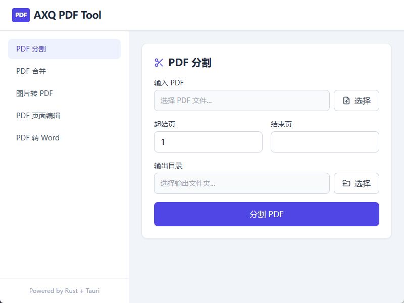
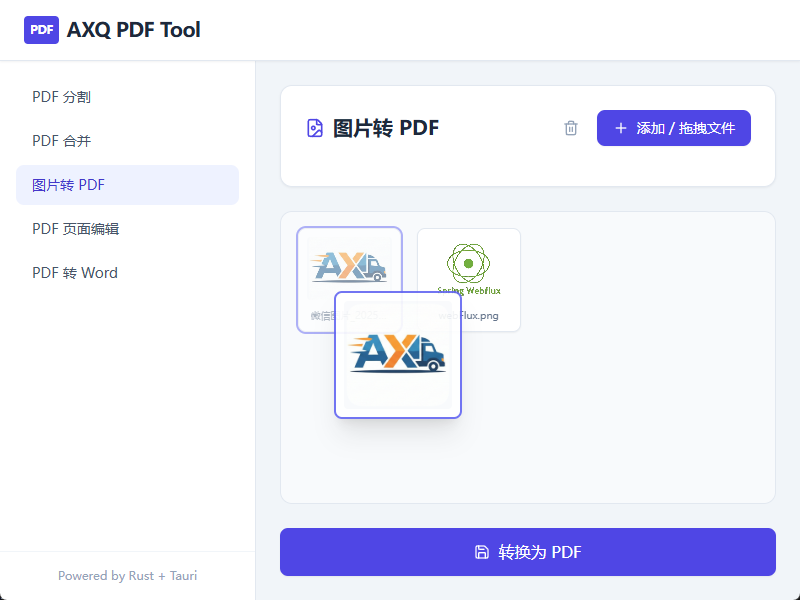
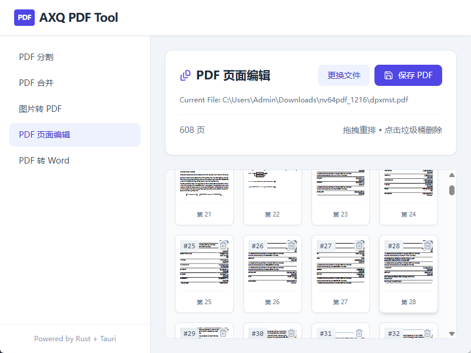

<h1 align="center">AXQ PDF Tool</h1>

<div align="center">
    <a href="README.md">English</a> | <a href="README_CN.md">简体中文</a> | <a href="README_JA.md">日本語</a> | <a href="README_KO.md">한국어</a> | <a href="README_RU.md">Русский</a>
</div>

<br />

**AXQ PDF Tool** — это мощный, безопасный и ориентированный на конфиденциальность локальный набор инструментов для работы с PDF, созданный с использованием **Tauri** и **Rust**.

В отличие от онлайн-инструментов, AXQ PDF Tool обрабатывает все файлы локально на вашем устройстве, гарантируя, что ваши документы никогда не покинут ваш компьютер.

## ✨ Возможности

### Разделение PDF
Извлечение определенных диапазонов страниц из документа.



### Объединение PDF
Объединение нескольких файлов PDF в один с поддержкой перетаскивания.

### Изображение в PDF
Конвертация изображений (JPG, PNG, BMP) в PDF.



### Редактирование PDF
Просмотр миниатюр страниц, изменение порядка или удаление страниц.



### PDF в Word
Преобразование PDF-документов в формат Word (.docx).

## 🚀 Особенности

- **Конфиденциальность**: Без загрузки на сервер. Все операции выполняются локально.
- **Высокая производительность**: Создано на Rust и Tauri.
- **Современный интерфейс**: Отзывчивый UI на React и Tailwind CSS.
- **Мультиязычность**: Поддержка английского, китайского, японского, корейского и русского языков.

## 🛠️ Технологический стек

- **Core**: [Rust](https://www.rust-lang.org/) (Tauri v2)
- **Frontend**: [React](https://reactjs.org/) + [TypeScript](https://www.typescriptlang.org/)
- **Styling**: [Tailwind CSS](https://tailwindcss.com/)

## 📦 Установка и разработка

1. **Предварительные требования**:
   - Установите `Rust` и `Cargo`.
   - Установите `Node.js` и `npm`.

2. **Установка зависимостей**:
   ```bash
   cd app
   npm install
   ```

3. **Запуск сервера разработки**:
   ```bash
   npm run tauri dev
   ```

4. **Сборка проекта**:
   ```bash
   npm run tauri build
   ```

## 📄 Лицензия

[MIT License](LICENSE)
